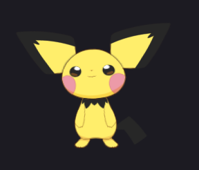

# Pichu AI Assistant

<p align="center">
  <i>Your voice-enabled desktop pet for Windows</i>
</p>

A voice-driven Windows desktop assistant, built with **PyQt5**, that controls
real apps (Stremio, Zen Browser, mpv, Android Studio) and a **Live2D model**
(bunny) you talk to through the microphone and that answers back.

By default it acts like a "pet" crouched in the corner of your screen, with a
floating music widget and a silent voice chat. Everything runs locally: replies
are generated through a **ModelRelay** (on port 7352) that you set up yourself;
Pichu is just the "hands".

> **Notice**: the IlloJuan (RVC) voice, the whisper model and Pichu's Live2D
> model are NOT included in this repository. They are optional/add-on assets.
> Without them, Pichu speaks with Edge-TTS.

<p align="center">
  
</p>

---

## What it does

- **Always-listening voice** (`speech_recognition`): "hey Pichu, play a song by
  aespa", "open the next Arcane episode", "search a Hollow Knight video", etc.
- **Background music playback** with `mpv` + `yt-dlp` + `ytmusicapi`
  (no browser, no focus, no windows). If the engine fails it does **not** go
  opening tabs wildly: it tells you and retries.
- **Stremio**: opens shows/movies and plays the next episode of your series via
  OCR/vision, fullscreen and focused.
- **Zen Browser through WebDriver (BiDi/geckodriver)** for YouTube and searches,
  attaching only to already-running instances (never opens a new one).
- **Per-process volume** with WASAPI (pycaw): mouse wheel over Pichu or the
  widget adjusts ONLY the music volume, never the system volume.
- **Draggable music widget** with *Cozy UI Pack* backgrounds.
- **Persistent memory** (SQLite) + habit patterns + local telemetry.

---

## What you need to run it

### 1. Python and dependencies

Windows + **Python 3.11** (64-bit). Install the dependencies:

```bash
pip install PyQt5 PyQtWebEngine pyautogui pyperclip pywin32 comtypes \
            pycaw pygame edge-tts openai soundfile torch numpy \
            speechrecognition Pillow psutil ytmusicapi yt-dlp
```

### 2. Binaries and assets

| Project path | Purpose | Where to get it |
|---|---|---|
| `bin/mpv/mpv.exe` | Lightweight media engine (mpv) | https://mpv.io/ (unzip just the `.exe` into `bin/mpv/`) |
| `geckodriver/geckodriver.exe` | Drive Zen/YouTube in the background | https://github.com/mozilla/geckodriver/releases |
| `assets/<your-model>/` | Live2D model for the avatar | Any Live2D model with a `.model3.json` (Pichu's own model is NOT bundled, see *Credits*) |
| `UI_Pack/` | Widget/menu images | *Cozy UI Pack* (or swap in your own pack) |

### 3. The "brain" (ModelRelay) on `127.0.0.1:7352`

`brain.py` points to `http://127.0.0.1:7352/v1` with `api_key="dummy-key"`.
You need an OpenAI-compatible server on that port (e.g. a proxy to a local or
cloud API). Without it, "smart" commands reply something like "I'm having
trouble connecting to my brain". The local fastpath (music, volume, Stremio,
etc.) does NOT need the ModelRelay.

### 4. External apps it drives

- **Zen Browser** (`zen.exe`) for YouTube Music and searches.
- **Stremio** (`stremio-shell-ng.exe`) for shows and movies.
- **Android Studio** (optional) for the "open project X in Android Studio" command.

---

## How to run it

```bash
python main.py          # with a console window (recommended for debugging)
```

Or headless:

```bash
python lanzador.py      # uses pythonw.exe and stays in the background
```

Pichu starts hidden, as a pet in the corner. Interactions:

- **Click on Pichu** (on its body): stops the voice and the current action.
- **Drag it** by pressing on its body to move it (any monitor); the position is
  saved in `pichu_pos.json`.
- **Mouse wheel** over Pichu: music volume (per-process, never the master).
- **Right-click** on Pichu: menu (expression, mute, type a command, hide, quit).
- **Music widget**: appears while something plays; drag it, pause, next, volume
  and close.

---

## Project layout

```
actions.py        Desktop tools (Windows apps, URLs, folders...)
audio_control.py  Per-process volume with WASAPI (pycaw)
brain.py          Fastpath + LLM agent (ModelRelay) + reply TTS
context.py        Context prompt (memory + telemetry)
hammer.py         Windows window helpers (win32)
lanzador.py       Headless launcher with pythonw.exe
main.py           Entry point: microphone worker + GUI + tray
memory.py         Persistent memory (SQLite)
musica_widget.py  Floating music widget (draggable, UI Pack)
mute.py           "Not listening" state
patterns.py       Habit patterns derived from memory
reproduccion.py   mpv + yt-dlp engine (background music) + state widget
stop.py           Global "stop action" flag (click on Pichu)
telemetry.py      Quiet local activity watcher (SQLite)
tools.py          LLM agent tools (Stremio, Zen, music, OCR...)
ui.py             Live2D avatar (QtWebEngine + PixiLive2D) + tray + chat
vision.py         OCR and screen clicks (Tesseract/Windows OCR)
zen_bidi.py       WebDriver (BiDi + geckodriver) bridge to Zen
```

---

## Model gallery

The bunny is a Live2D model with expressions that change with what it does
(talking, shocked, angry, happy...). Screenshots:

| Normal | Happy | Angry |
|---|---|---|
|  |  |  |

---

## Credits & notes

- **Live2D model**: the Pichu model used in the screenshots was created by
  **@Raddleii** on Twitter. It is licensed for personal use only and **must not
  be reposted**, which is why the model files are not in this repository —
  add your own legally-usable Live2D model to `assets/`. If you use one of
  @Raddleii's models, credit it as required by its terms.
- **UI Pack**: *Cozy UI Pack* demo by **dobo_ui** (itch.io) — see
  `UI_Pack/developerNote_dobo_ui.txt`. Consider buying the full pack.
- **Cover GIF**: found on Pinterest (not bundled; hot-linked URL only).
- The code assumes Windows (win32, WASAPI, per-user paths via `USERNAME`).
- Nothing in this project uploads data to the Internet: everything stays on your
  PC (memory, telemetry, audio from your own apps).